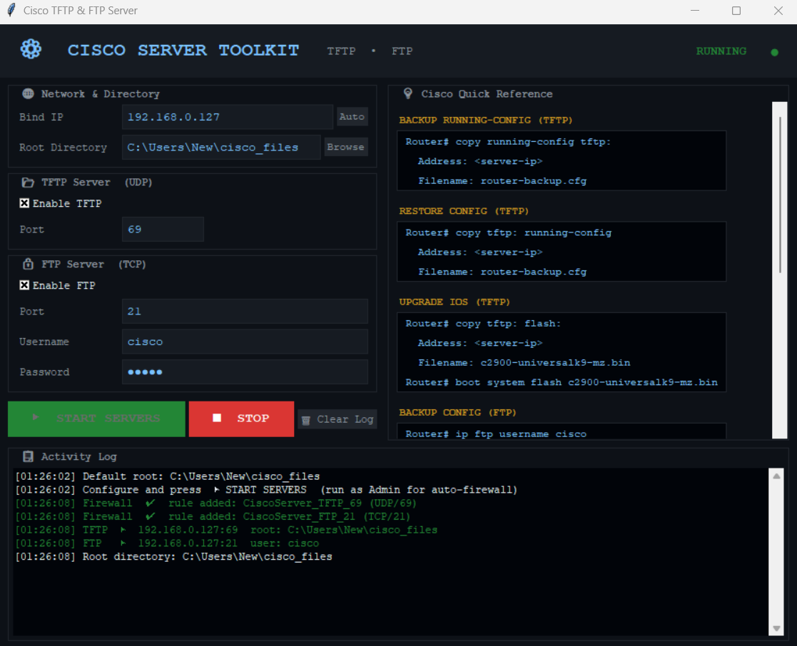

Cisco TFTP & FTP Server
A Windows GUI application providing TFTP and FTP services for Cisco network devices.

Usage

Must run as Administrator

Double-click open_ports_and_run.bat → Run as administrator.
The script will open the required firewall ports and launch the application automatically.

Features

TFTP Server (UDP/69) — no authentication required
FTP Server (TCP/21) — username/password authentication (default: cisco / cisco)
Automatic Windows Firewall rules on start/stop
Built-in Cisco command reference panel
Real-time activity log

Project Structure
├── CiscoServer.exe            # Ready-to-run application
├── open_ports_and_run.bat     # Launcher with auto firewall setup
└── source/
    ├── cisco_server.py        # Source code
    └── build_windows.bat      # Build EXE from source

Building from Source
pip install pyftpdlib tftpy pyinstaller
Right-click build_windows.bat → Run as administrator.

Common Cisco Commands
! Backup config via TFTP
Router# copy running-config tftp:

! Restore config via TFTP
Router# copy tftp: running-config

! Upgrade IOS via TFTP
Router# copy tftp: flash:

! Backup config via FTP
Router# ip ftp username cisco
Router# ip ftp password cisco
Router# copy running-config ftp:

! ROMMON recovery
rommon 1> TFTP_SERVER=<server-ip>
rommon 2> TFTP_FILE=<ios-image.bin>
rommon 3> tftpdnld
